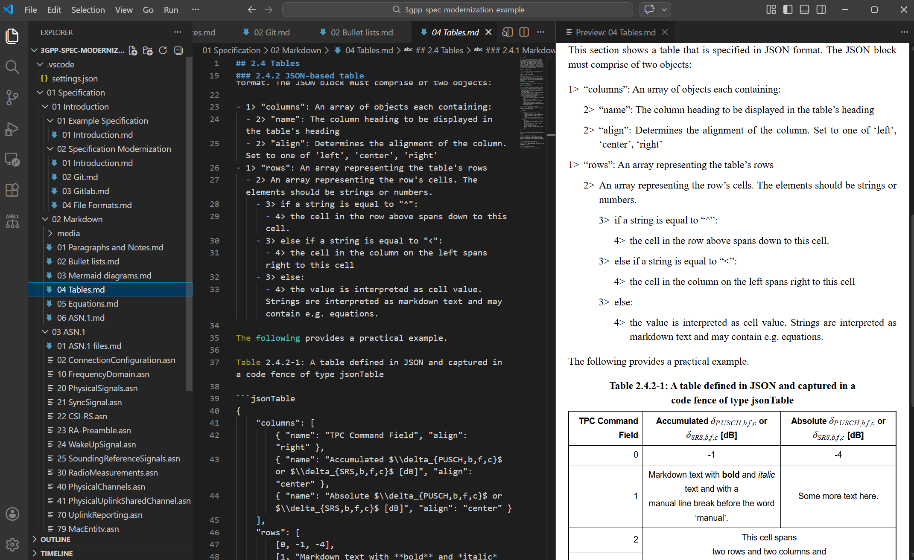
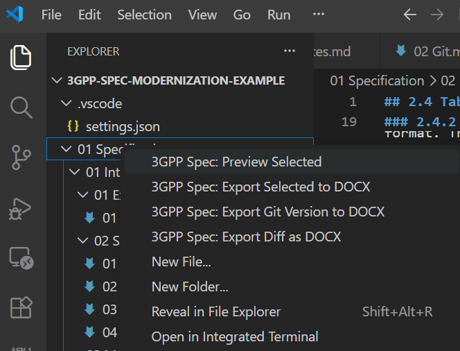
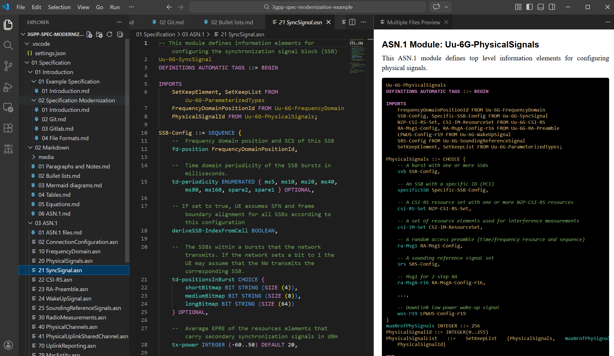
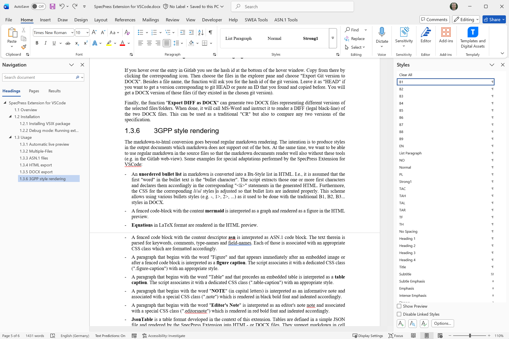
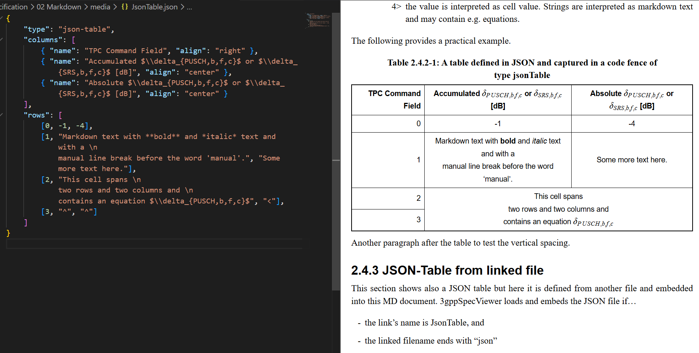

# 1 SpecPress Extension for VS-Code

The SpecPress Extension for VS-Code offers functionality to convert 3GPP specifications (written in a tree of markdown, asn, json... files) into an HTML or DOCX file that offers the same look&feel as 3GPP's traditional DOCX specifications.

The extension integrates into VS-Code/VS-Codium where it renders a live preview of the opened/selected documents or folders and offers menu options to export the files in HTML or DOCX format.

The extension is a thin VS Code integration layer on top of the [specpress](https://github.com/Ericsson/specpress) library, which contains the core conversion logic (markdown-to-HTML, markdown-to-DOCX, section numbering, ASN.1 handling, etc.).

## 1.1 Overview

- **Live preview** - Live preview of the currently edited Markdown- or ASN.1 file with real time updates and synchronized scrolling.
- **Multiple File Preview** - Shows a concatenated live preview of all selected files and/or folders in the VSC explorer pane.
- **HTML Export** - Export current preview or the selected files/folders to a standalone HTML file with a media directory containing all images. Supports exporting from local files or from any git commit/branch/tag.
- **DOCX Export** - Exports the selected files/folders as a DOCX document in 3GPP style including appropriate style settings. Supports exporting from local files or from any git commit/branch/tag.
- **DOCX DIFF** - Exports two DOCX documents from two different versions (local version, branches, commits, ...) and generates a tracked-changes comparison in MS-Word.
- **Section Numbering** - Automatic section number derivation from the folder/file hierarchy using x-placeholders in headings and captions.
- **Cover Page** - Configurable cover page for spec-root-level exports in both HTML and DOCX.
- **JsonTable** - A table format where columns and rows are defined in JSON (in separate JSON files linked into MD files or embedded directly into a MD code fence). The JsonTable supports markdown formatting in cells (including equations, line-breaks, ...) as well as horizontally and vertically merged cells.
- **Mermaid Caching** - Rendered mermaid diagrams (embedded in code fences inside MD files) are cached in the repository for fast exports and stable DOCX diffs.

## 1.2 Installation

Ensure that VS-Code or VS-Codium is installed. Download the latest `.vsix` file from the [GitHub Releases](https://github.com/Ericsson/SpecPressExt/releases) page.

Install the VSIX file:

- **VS-Code**: Follow the instructions at [Install from a VSIX](https://code.visualstudio.com/docs/configure/extensions/extension-marketplace#_install-from-a-vsix), or run:
  ```bash
  code --install-extension specpressext-x.y.z.vsix
  ```
- **VS-Codium**: Run:
  ```bash
  codium --install-extension specpressext-x.y.z.vsix
  ```

## 1.3 Configuration

The VSC extension requires a few configuration parameters. It is recommended to configure those in the `settings.json` inside the workspace in which you develop your specification. This ensures that all users use the same settings and that individual users don't need to configure the settings themselves.

The following settings can be configured in VS-Code's workspace or user settings under the `specpress` prefix:

| Setting | Type | Default | Description |
| --- | --- | --- | --- |
| `specpress.specificationRootPath` | string or string[] | `""` | (*mandatory*) Path(s) to the specification root folder(s), relative to workspace root or absolute. Set it to `"."` if your specification root is equal to your workspace root. |
| `specpress.deriveSectionNumbers` | boolean | `false` | Enable automatic section number derivation from folder/file hierarchy. |
| `specpress.coverPageTemplate` | string | `""` | Path to an HTML template for the cover page. |
| `specpress.coverPageData` | string | `""` | Path to a JSON file with cover page placeholder values. |
| `specpress.defaultExportFolder` | string | `""` | Default folder for HTML and DOCX export dialogs. Overridden by the last chosen folder during the session. |
| `specpress.multiPagePreviewDefaultPath` | string | `""` | Default path for the "Restore Multi-File Preview" command. |
| `specpress.renderers` | object | `{}` | Custom HTML renderers for markdown elements (advanced). |
| `specpress.cssFile` | string | SpecPress default | Path to a custom CSS file for HTML preview and export. It is recommended not to set this parameter and rather rely on the default CSS provided with the SpecPressExtension. |
| `specpress.mermaidConfigFile` | string | SpecPress default | Path to a mermaid configuration JSON file. It is recommended not to set this parameter and rather rely on the default configuration provided with the SpecPressExtension. |

## 1.4 Usage

### 1.4.1 Automatic live preview

After installing and configuring the extension, open a markdown- or ASN.1 file within your `specificationRootPath` in the VSC editor. Right-click into the editor to open the context menu and choose `SpecPress: Open Preview`. The SpecPress extension opens a live preview, updates it as you edit your source file and scrolls accordingly.



Figure 1.4.1-1: Live preview of markdown files

When you switch to another source file the live preview updates, too.

When you close the preview it remains closed until you re-open it via the context menu.

### 1.4.2 Multiple-Files

We expect the specification to be split into many markdown-, ASN.1- and JSON files which represent one or a few sub-section each. Furthermore, those markdown files should be ordered in a suitable folder structure (e.g. by sections).

To preview a rendered version of some or all source files, select the files and/or folders in the explorer pane (using Ctrl- or Shift) and right-click to open the context menu. Choose "SpecPress: Preview Selected".

SpecPress asks for the version that you would like to preview. Press *ENTER* to see the current version of the local files. Alternatively, choose a Git commit from the drop-down menu or by pasting a hash.



Figure 1.4.2-1: Context menu multi-file operation

Assume that you scroll in the multi-page preview and would like to edit a specific section. To open the corresponding source file in the editor pane, right click into the respective section of the preview and choose "SpecPress: Edit this section" (or try to double-click into the section). If you later want to switch to the previous multi-page preview, press "Ctrl-Shift-M".

### 1.4.3 ASN.1 files

Beyond regular markdown files SpecPress also comprehends *asn* files. If a live preview is activated for such files, the plug-in loads the content of those files and interprets it as content of a fenced code block of type *asn* (see below) and hence renders them in the same way. And when generating a preview of an entire folder (and possible sub-folders) the preview loads also the contained *asn* files and embeds them into the preview.

In the multi-page preview, SpecPress extracts leading comment lines (if any) and the module name from the *asn* file and creates a delimiting section heading for this ASN.1 module as well as a descriptive paragraph prior to the actual ASN.1 code.



Figure 1.4.3-1: Live preview of ASN.1 files

### 1.4.4 HTML export

The live-preview (of one or several files) may be exported to a standalone HTML file. Right-click onto the live preview and choose "**Export to HTML**". A save dialog opens with a timestamped default filename (e.g. `2026-03-31 14-30-00 Export.html`). The dialog initially opens in the folder configured via `specpress.defaultExportFolder`, or in the last used export folder.

The function converts and exports the concatenated files including an embedded CSS and scripts to render the embedded mermaid figures. It also creates a *media* directory next to the HTML file containing all images used in the document.

The HTML file can be shared and opened in a browser.

### 1.4.5 DOCX export

To export a DOCX version, select one or more files and/or folders in the VS-Code explorer pane. Right-click and choose "**Export Selected to DOCX**". The extension then guides you through the following steps:

1. **Version selection** — A searchable commit picker appears showing the 200 most recent git commits. Choose "Local files (current workspace)" to export the current working copy, or select a specific commit/branch/tag to export an older version. You can type to filter by commit message, hash, or ref name.

2. **Save location** — A save dialog opens with a timestamped default filename (e.g. `2026-03-31 14-30-00 Export.docx`). If exporting from a git commit, the short hash is appended (e.g. `...Export_abc1234.docx`). The dialog initially opens in the folder configured via `specpress.defaultExportFolder`, or in the last used export folder.

3. **Export** — The extension collects all markdown and ASN.1 files from the selection, processes section numbers, renders mermaid diagrams, converts equations, and generates the DOCX file with 3GPP-style formatting.

When exporting at the spec root level (i.e. the folder configured in `specpress.specificationRootPath`), a cover page is automatically included if `specpress.coverPageTemplate` and `specpress.coverPageData` are configured.



Figure 1.4.5-1: A DOCX file exported by the SpecPress extension and opened in MS-Word

To generate a **PDF** version of the specification, it is recommended to generate the DOCX version and to convert that into PDF.

### 1.4.6 DOCX DIFF (Change Request)

The "**Compare as DOCX**" function generates a tracked-changes comparison between two versions of the specification. This is useful for creating traditional Change Requests (CRs) or for reviewing changes between any two versions.

1. **Select files/folders** — Choose the files or folders to compare in the explorer pane. Right-click and choose "**Compare as DOCX**".

2. **Baseline version** — Select the original (baseline) commit from the commit picker. This is the "before" version.

3. **Revised version** — Select the revised (target) commit, or choose "Local files" to compare against the current working copy.

4. **Author name** — Enter the author name for tracked changes (default: "SpecPress").

The extension generates two DOCX files (baseline and revised), then launches MS-Word with instructions to produce a legal black-line comparison. MS-Word must be installed for this function to work.

### 1.4.7 3GPP style rendering

The markdown-to-html conversion goes beyond regular markdown rendering. The intention is to produce styles in the output documents which markdown does not support out of the box. At the same time, we want to be able to use regular markdown in the source files so that the markdown documents render well also without these tools (e.g. in the Gitlab web-view). Some examples for special adaptations performed by the SpecPress Extension:

- An **unordered bullet list** in markdown is converted into a Bx-Style list in HTML and DOCX. I.e., it is assumed that the first "word" in the bullet text is the "bullet character". The script extracts those one or more first characters and declares them accordingly in the corresponding "\<li\>" statements in the generated HTML. Furthermore, the CSS for the corresponding *li*/*ul* styles is adjusted so that bullet lists are indented properly. This scheme allows using various bullets styles (e.g. -, 1>, 2>, [1], [2], ...) as it used to be done with the traditional B1, B2, B3... styles in DOCX.
- A fenced code-block with the content **mermaid** is interpreted as a graph and rendered as a figure.
- **Equations** in LaTeX format are rendered in the HTML preview and embedded as native equations in an exported DOCX file.
- A fenced code block with the content descriptor **asn** is interpreted as ASN.1 code block. The text therein is parsed for keywords, comments, type-names and field-names. Each of those is associated with an appropriate CSS class which are formatted accordingly.
- A fenced code block with any other language tag (or no tag) is rendered with the **PL** style (Courier New, black background) in DOCX.
- A paragraph that begins with the word "Figure" and that appears immediately after an embedded image or after a fenced code block is interpreted as a **figure caption**. SpecPress associates it with a dedicated CSS class (".figure-caption") with an appropriate style in DOCX.
- A paragraph that begins with the word "Table" and that precedes an embedded table is interpreted as a **table caption**. SpecPress associates it with a dedicated CSS class (".table-caption") with an appropriate style in DOCX.
- A paragraph that begins with "**NOTE**" or "**NOTE N:**" (where N is a number) is interpreted as an informative note and associated with a special CSS class (".note") and DOCX style NO. Inside table cells, NOTE paragraphs get the TAN style with hanging indentation.
- A paragraph that begins with "**EXAMPLE**" is interpreted as an example and associated with CSS class ".example" and DOCX style EX.
- A paragraph that begins with the word "**Editor's Note**" is interpreted as an editor's note and associated with a special CSS class (".editors-note") which is rendered in red font and indented accordingly.
- A level-1 heading starting with "**Annex**" is treated as an Annex heading with a line break after the first colon (Heading8 style in DOCX).
- **Hyperlinks** in markdown are exported as clickable hyperlinks in both HTML and DOCX (with the Hyperlink character style: blue, underlined).
- **Images** are embedded in DOCX with their native aspect ratio preserved. Large images are scaled to fit the page width; small images are not upscaled beyond 125 DPI to avoid pixelation.
- **JsonTable** is a table format developed in the context of this extension. Tables are defined in a simple JSON file and rendered by SpecPress into HTML- or DOCX files. They support markdown in cell values and thereby also equations and line-breaks. It is also possible to merge cells horizontally and/or vertically.



Figure 1.4.7-1: Screenshot of a JsonTable in VS-Code

### 1.4.8 Section numbering

SpecPress can derive section numbers automatically from the folder and file hierarchy. This is enabled by setting `specpress.deriveSectionNumbers` to `true` and configuring `specpress.specificationRootPath` to point to the specification's root folder.

#### 1.4.8.1 Folder and file structure

The specification is organized as a tree of numbered folders and files:

```txt
spec/                          ← specificationRootPath
  01 Scope/
    00 Scope.md                ← section 1 (from folder "01")
  02 References/
    00 References.md           ← section 2
  03 Definitions/
    01 Terms.md                ← section 3.1
    02 Abbreviations.md        ← section 3.2
```

Each folder and file name starts with a number. The numbers are collected along the path from the spec root to the file, skipping zeros (which denote "this file provides the heading for its parent folder"). The collected numbers form the **derived section number**.

For example, `spec/03 Definitions/02 Abbreviations.md` derives section number `3.2`.

#### 1.4.8.2 x-placeholders in headings

Inside each markdown file, headings use **x-placeholders** instead of hardcoded section numbers:

```markdown
## x.x Definitions

### x.x.1 Terms

### x.x.2 Abbreviations
```

The `x` components are replaced by the derived section number at render time. The number of `x` components must match the depth of the derived section number. For example, in a file with derived number `3.2`:

- `## x.x Abbreviations` → `## 3.2 Abbreviations`
- `### x.x.1 General` → `### 3.2.1 General`
- `### x.x.2 Specific` → `### 3.2.2 Specific`

Headings without x-placeholders and without leading numbers are left unchanged (unnumbered headings). Headings with manually written section numbers (e.g. `## 3.2 Abbreviations`) produce an **E.R.R.O.R** marker to flag the inconsistency.

#### 1.4.8.3 x-placeholders in captions

Figure and table captions also support x-placeholders:

```markdown
Table x.x-1: My table caption

Figure x.x.x-1: My figure caption
```

The `x.x` part is replaced by the section number of the most recent resolved heading. The number after the dash is a sequential identifier within the section.

#### 1.4.8.4 Auto-generated folder headings

When a folder does not have a `00`-prefixed file to provide its heading, SpecPress automatically generates a heading title from the folder name. These auto-generated headings are marked with `<!-- AUTO-HEADING -->` comments internally and are not flagged as errors.

### 1.4.9 Mermaid diagram caching

Mermaid diagrams are rendered to SVG using a hidden VS-Code webview. The mermaid library (`mermaid.min.js`) is automatically downloaded from CDN on first use and cached in VS-Code's global storage. It is refreshed every 24 hours; if offline, the stale cache is reused.

#### 1.4.9.1 SVG caching in the repository

Rendered SVG files are cached in a `cached/` directory next to the specification root folder (i.e. as a sibling, not inside the spec):

```txt
repo/
  spec/           ← specificationRootPath
    03 Building blocks/
      05 Mermaid.md
  cached/          ← SVG cache (sibling of spec)
    a1b2c3d4...svg
    e5f6a7b8...svg
```

Each SVG file is named by the SHA-256 hash of the mermaid source code and the mermaid configuration. This means:

- **Same source → same file** — unchanged diagrams produce identical SVG bytes across exports, eliminating false tracked changes in DOCX DIFF comparisons.
- **Fast re-exports** — cached diagrams are served from disk without re-rendering.
- **Shareable via git** — the `cached/` directory should be committed to the repository. Colleagues who clone the repo get the pre-rendered SVGs and don't need to re-render them.
- **Automatic cleanup** — after each export, SpecPress scans all markdown files in the spec root for mermaid fences and deletes any cached SVGs that are no longer referenced.

## 1.5 Building from Source

If you prefer to build the VSIX locally instead of downloading from [GitHub Releases](https://github.com/Ericsson/SpecPressExt/releases):

```bash
git clone https://github.com/Ericsson/SpecPressExt.git
cd SpecPressExt
npm install
build.cmd
```

Requires Node.js 16 or higher. The build script runs the test suite and then packages the extension into a `.vsix` file in the `vsix/` directory. Install the resulting file as described in [1.2 Installation](#12-installation).

For standalone (CLI) usage and CI pipeline integration, see the [specpress](https://github.com/Ericsson/specpress) library.

## 1.6 Development and Testing

### 1.6.1 Getting the source code

Clone the repository and install dependencies as described in [1.5 Building from Source](#15-building-from-source).

### 1.6.2 Running in debug mode

When you want to run the plugin in debug/development mode you should load this repo as workspace in VS-Code. Then you may press F5 to start the launch script (see ".vscode" subfolder). But before doing so, make sure that you cloned also an example specification e.g. from `https://forge.3gpp.org/rep/fs_6gspecs_new/ericsson_multifiletypes_onem2m_example`.

### 1.6.3 Running tests

All tests run with Node.js and do not require VS-Code. After `npm install`, run the test suite:

```bash
npm test
```

The extension-specific tests are in `test/vscode/` and cover the ConfigLoader, StateManager, and JsonTable editor logic.

The bulk of the conversion tests (markdown-to-HTML, markdown-to-DOCX, section numbering, ASN.1, etc.) live in the [specpress](https://github.com/Ericsson/specpress) library.

### 1.6.4 Building the VSIX package

Before building a new VSIX package, remember to increment the version number in [package.json](package.json).

To build the installable VSIX package, run:

```bash
build.cmd
```

This script performs the following steps:

1. Runs the full test suite (`npm test`) — aborts if any test fails.
2. Syncs `package-lock.json`.
3. Packages the extension into a `.vsix` file in the `vsix/` directory and removes previous vsix versions from that folder.

The resulting VSIX file can be distributed and installed in VS-Code.

## 1.7 Contributing

### 1.7.1 Architecture principles

This extension is a **thin VS Code shell** around the [specpress](https://github.com/Ericsson/specpress) library. The boundary is strict:

- Extension code (`src/vscode/`) handles ONLY VS Code integration: commands, webviews, configuration, UI.
- All markdown parsing, conversion, rendering, and file processing logic lives in `specpress`.
- Never duplicate specpress logic in the extension.

Key patterns:

- **ConfigLoader** — centralized settings access with caching; invalidated on `onDidChangeConfiguration`, re-reads lazily.
- **StateManager** — single object for all runtime state; no scattered module-level variables.
- **Command isolation** — each command handler is a self-contained async function in its own file under `src/vscode/`, receiving `state`, `config`, and `context` as parameters.
- **Singleton panel** — reuse the existing webview panel; clean up on disposal.
- **Lifecycle management** — tie listener disposal to panel disposal; push all disposables to `context.subscriptions`.

### 1.7.2 Coding style

- **CommonJS** modules (`require()` / `module.exports`)
- **2-space indentation**, no semicolons
- **Single quotes** for strings, template literals for HTML/multi-line
- **camelCase** for functions and variables, **PascalCase** for classes
- **Command IDs**: `specpress.` prefix (e.g., `specpress.preview`)
- Import dependencies at the top, grouped: VS Code API → Node.js built-ins → specpress library

### 1.7.3 Anti-patterns to avoid

- ❌ Implementing conversion logic in the extension — delegate to specpress
- ❌ Scattered module-level `let` variables — use StateManager
- ❌ Hardcoded path separators — use `path.join()`
- ❌ Ignoring user cancellation (null from dialogs/pickers) — always check and return early
- ❌ Creating new panels on every invocation — reuse with singleton pattern

### 1.7.4 Co-development with specpress

To work on both repos simultaneously, clone `specpress` as a sibling folder and run:

```bash
co-develop.cmd
```

This links your local specpress via `npm link`. Press F5 to launch the Extension Development Host with both local codebases active.
